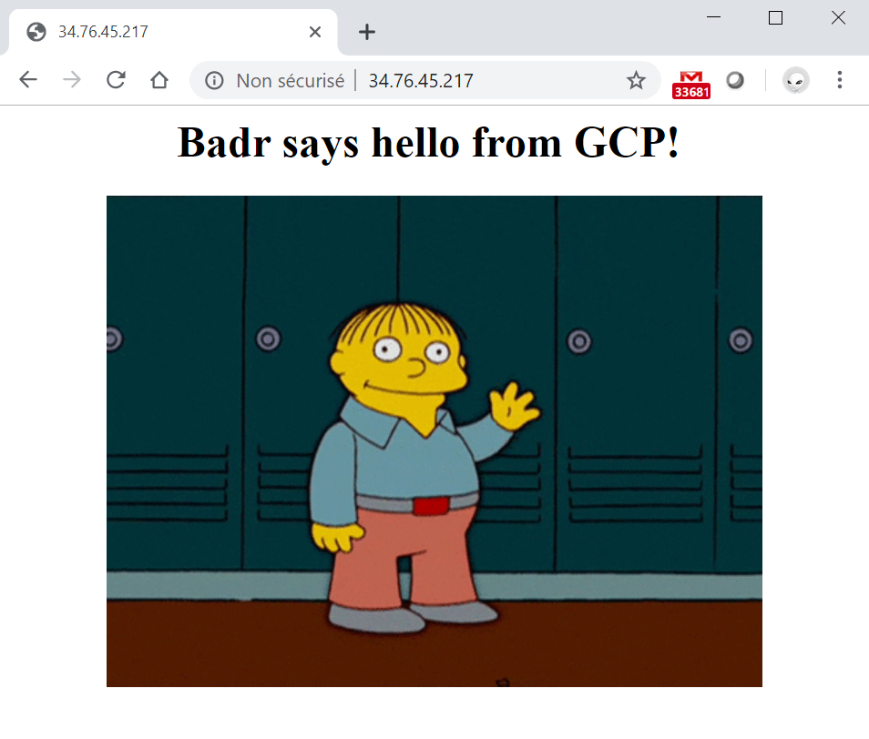

# Serving a custom web page from GCP using terraform

In this example I'm using `terraform` to build an infrastructure on GCP to server a custom web page.
I'll be using terraform's `provisioner` to run the script that installs `Nginx` and customize the default `index.html`page.

# The code I wrote with Terraform 

I basically create these 4 files when building resources with terraform. This is just my way of doing things. There are many best practices and recommendations availabe on how to write a good piece of terraform code. I'm planning to cover this in a later example.

`provider.tf` specifies the connection information needed to connect to my GCP account. I tried to make some comments in the code for this part, yet more about how to use GCP provider is available in official terraform doc.

`vars.tf` contains variables declaration that I will be calling in the code.

`main.tf` is where I declare all the resources terraform should create in GCP when applying the code. Comments are available in the code for better understanding.

`outputs.tf` specifies the value I want to print out after the completion of the build, the URL of the web page in in this case, basically it's just a concatenation of "http://" and the public IP of the created instance.

# The provisioner part aka web server installation and web page customisation

One of the outstanding power points of terraform and cloud providers is the possibility to manage configuration and create things automatically while spinning out compute instances. This can be made throug 2 methods: 

##### 1 - using startup scripts 

This is a provided functionnality by cloud providers and Teeraform takes profit of it using cloud provider's APIs. To use this method in terraform for GCP I simply invoke the parameter `metadata_startup_script` and give it the pathe of my script `user_data.sh` as a value. I commented this parameter in my code since I'm interested in the seconde methode instead. 

##### 2 - using terraform provisioner

Terraform makes it possible to manage configuration in the instances thrugh the use of the `provisioner` parameter. With is it's possible to prepare the instances by running configuration shell script, Ansible playbooks, Chef cookbooks and even copying local files to instances. All terraform needs to achieve that is a working key based ssh connection which I configure in the `connection` part of the `provisioner` parameter.

First of all I generate a ssh key pair using `puttygen` since I'm in a windows environnment. Then I take the public key and formate it as follows:
```
<protocol> <key-blob> <user-name>
```
where `protocol` is the encryption protocol, `ssh-rsa` in my case. `key-blob`the content of the public key (the long string that ends with an equal sign). Last `user-name`is the user name thet GCP creates when spinning the instances, this can be retrived from GCP console.

Once done I take the formatted input and upload it in the ssh-keys menu in GCP compute engine. One more thing the private key that will set in my host needs to be in `.pem` extension in order for terraform to recognise it, so a conversion from `.ppk` to `.pem` is required as I work in a Windows machine.

Now that everything is setup for the connction, I will first use the `file provisioner` to copy the `user_data.sh` to a temporary location in the instance then use the `shell provisioner` tho make it executable and run it.

The code for this part is located within the instance declaration in `main.tf` and commented for mor understanding. 

# The results

I issue `terraform apply` to build my resources in GCP, once the instance created, Terraform will ssh to it with the given connection info, copy my shell script and run it. The commande `terraform apply` is by default verbose so everything running in the instance is printed out on the screen including the script execution.

And voila!




